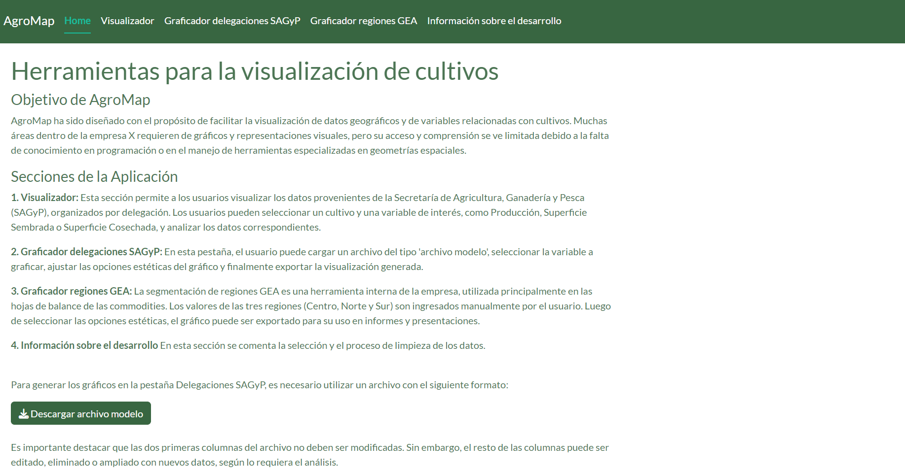
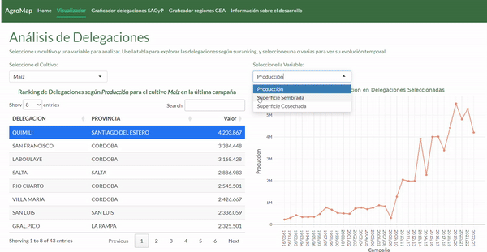
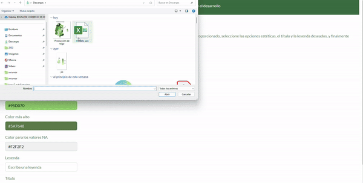
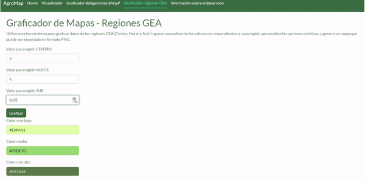
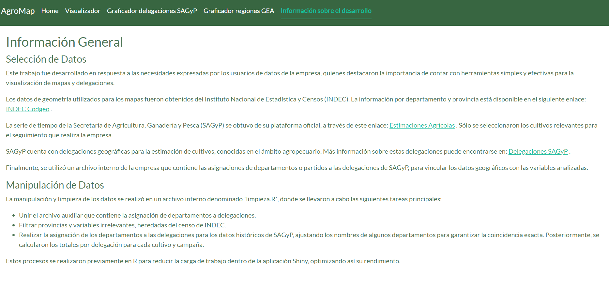

# **AgroMap: Herramientas para la Visualización de Cultivos**

AgroMap es una aplicación diseñada para facilitar la visualización de datos geográficos y variables relacionadas con cultivos. Este proyecto responde a las necesidades de diversas áreas dentro de la empresa X, donde los usuarios requieren gráficos y representaciones visuales pero enfrentan limitaciones por la falta de conocimiento en programación y herramientas geoespaciales.

## **Características principales**
AgroMap cuenta con varias herramientas para explorar, analizar y visualizar datos de cultivos de manera sencilla e interactiva. Entre las principales funcionalidades se encuentran:

1. **Visualización de series de tiempo por delegación.**
2. **Generación de mapas interactivos basados en datos del usuario.**
3. **Segmentación y visualización de datos por regiones específicas (SAGyP y GEA).**

---

## **Estructura de la Aplicación**

### **Home**

La página principal de AgroMap introduce a los usuarios al propósito y funcionalidades de la aplicación. 

---

### **Visualizador**

En esta sección, los usuarios pueden:

- Seleccionar un cultivo y una variable para analizar.

- Explorar un ranking de delegaciones basado en la última campaña disponible.

- Visualizar la evolución temporal de las variables seleccionadas y la ubicación geográfica de las delegaciones en un mapa interactivo.

---

### **Graficador Delegaciones SAGyP**
Permite a los usuarios cargar archivos personalizados, ajustar la estética del mapa y generar gráficos que representan datos agregados por delegación. La funcionalidad incluye la exportación del gráfico para informes y presentaciones.

---

### **Graficador Delegaciones GEA**
Esta herramienta está diseñada para ingresar manualmente datos segmentados por regiones específicas (Centro, Norte, Sur) y generar mapas personalizados. Incluye opciones de personalización estética y exportación.

---

## **Información sobre el Desarrollo**

- **Datos de entrada:**
  - La geometría de los mapas fue obtenida del [INDEC](https://www.indec.gob.ar/indec/web/Institucional-Indec-Codgeo).
  - Los datos históricos de cultivos provienen de la Secretaría de Agricultura, Ganadería y Pesca (SAGyP): [Ver datos](https://datosestimaciones.magyp.gob.ar/reportes.php?reporte=Estimaciones).
  - Las asignaciones de departamentos a delegaciones fueron realizadas en base a un archivo interno de la empresa.

- **Procesamiento previo:**
  - Se realizaron tareas como la asignación de departamentos a delegaciones, filtrado de provincias irrelevantes y el cálculo de totales por delegación.

- **Tecnologías utilizadas:**
  - `Shiny` para el desarrollo de la interfaz interactiva.
  - `ggplot2` y `leaflet` para la generación de gráficos y mapas.
  - `dplyr` y `sf` para la manipulación de datos geo-espaciales.

---

